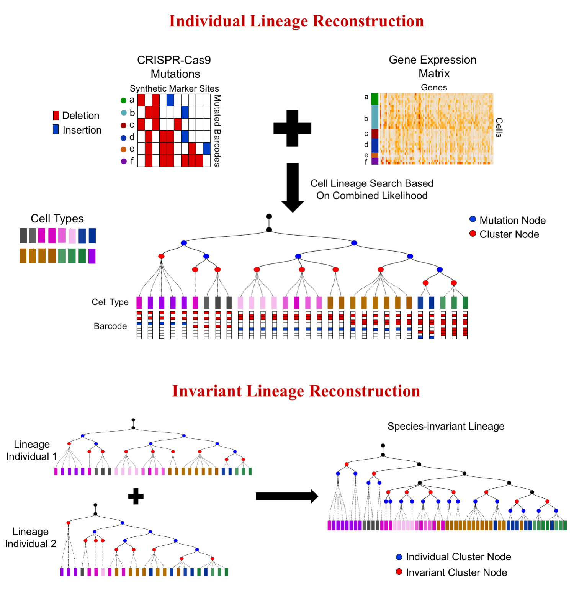

# LinTIMaT: Lineage Tracing by Integrating Mutation and Transcriptomic data

## Overview
__LinTIMaT__ is a statistical method for reconstructing lineages from joint CRISPR-Cas9 mutations and single-cell transcriptomic data. The method is described in the paper titled __"Single-cell Lineage Tracing by Integrating CRISPR-Cas9 Mutations with Transcriptomic Data"__. 

Recent studies combine two novel technologies, single-cell RNA-sequencing and CRISPR-Cas9 barcode editing for elucidating developmental lineages at the whole organism level. To utilize these two complementary data types for lineage tracing, we developed a novel computational method, LinTIMaT. LinTIMaT reconstructs cell lineages in a maximum-likelihood framework by integrating mutation and expression data. Using LinTIMaT, we can reconstruct lineage for a single individual as well as a consensus lineage by combining data from multiple individuals of the same species (see figure below).

 

See the [wiki](https://github.com/jessica1338/LinTIMaT/wiki) for details. __LinTIMaT__ can be executed from command line on Mac OS, Windows 10 and Linux machines.

